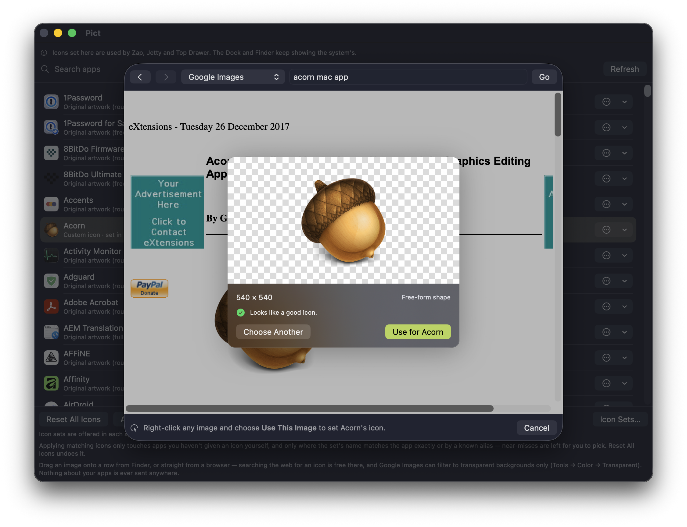

# Pict

**One icon change, everywhere.** Pict is the shared icon store behind
[Zap](https://github.com/L-K-M/Zap) (a ⌘-Tab switcher),
[Jetty](https://github.com/L-K-M/Jetty) (a Dock replacement) and
[Top Drawer](https://github.com/L-K-M/TopDrawer) (an edge-tab launcher) — and the
editor that fills it.

Give Safari a custom icon once and all three apps draw it.

**Latest release:** v<!-- version -->1.0.0<!-- /version --> · [Download](https://github.com/L-K-M/Pict/releases/latest)

> [!IMPORTANT]
> LLM Disclosure: this code base was written by or with the help of large language
> models, working from the [`AGENTS.md`](AGENTS.md) brief in this repo.



## Why this exists

Since macOS 26 (Tahoe) the system composites every app icon into one fixed
superellipse.

Zap, Jetty and Top Drawer all draw their own icons, so none of them is obliged to
show the masked version. Pict allows you to pick an icon for an app once, and all
three apps will show that icon for that app.

## What's in here

This repository is **two things**, which is why the layout looks unusual:

```
Package.swift          ← the repo root is a SwiftPM package
Sources/PictKit/         the read path, consumed by Zap, Jetty, Top Drawer and Pict
Tests/PictKitTests/
App/                     the Pict app — the editor, and everything only it needs
```

`Package.swift` has to be at the repo root because SwiftPM cannot depend on a
subdirectory of a repository. The app lives under `App/` and references the package
locally; the three other apps reference it remotely.

### PictKit — the read path

Small and boring on purpose: three independently released apps are pinned to it, so
the less it changes the better.

| | |
|---|---|
| `Store/` | the shared store — keys, entries, reading, writing, watching |
| `Artwork/` | recovering a bundle's own artwork, classifying its shape, normalising it |
| `Resolve/` | the resolution ladder and its cache; the only thing a hot path touches |
| `Migration/` | carrying Zap's existing icons into the shared store, once |

### Pict — the editor

Everything with exactly one consumer: picking and validating a file, rasterising
SVG, downloading icon themes, searching providers, browsing the web for a picture,
and the UI for all of it.

**Get Image from the Web.** A browser inside Pict — right-click any image, choose
*Use This Image*. It starts on [macOSicons](https://macosicons.com), Google Images
(filtered to transparent backgrounds), Openverse or Wikimedia Commons, but the
address field takes anything.

## The store

```
~/Library/Application Support/Pict/
  README.txt
  entries/
    Safari.app-1k2j4h.json
    Safari.app-1k2j4h.png
```

**One file per entry, not one manifest.** Three processes read-modify-writing a
single `manifest.json` will lose entries. Splitting it removes the problem rather
than managing it: two apps overriding two different targets touch two different
files and cannot conflict, two apps overriding the same one resolve by
last-writer-wins, every write is atomic, and the directory listing *is* the index.

Deleting the folder is always safe — every app falls back to the icons macOS
provides.

## Build

The package, which is all you need to work on the read path:

```bash
swift build
swift test
```

The app:

```bash
scripts/build.sh           # Release build, revealed in Finder
scripts/build.sh --debug --run
```

`build.sh` is a thin stub over the shared [release-tool](https://github.com/L-K-M/release-tool)
engine, as in Zap, Jetty and Top Drawer — clone that repo and run `./install.sh`
once. Or drive Xcode directly, which is what CI does:

```bash
xcodebuild -project App/Pict.xcodeproj -scheme Pict \
  -destination 'platform=macOS' CODE_SIGNING_ALLOWED=NO test
```

Requires macOS 13+ and a Swift 5.9 toolchain; CI pins Xcode 16.2.

## Releases

```bash
scripts/release.sh 1.1.0 --push
```

That bumps `MARKETING_VERSION` and the version line above, commits, tags `v1.1.0`
and pushes — which triggers CI to build, package a `.zip` and `.dmg`, and publish
the GitHub Release. See [`CICD.md`](CICD.md) for what runs when, and why the
builds are unsigned.

## License

Public domain — see [LICENSE](LICENSE).
